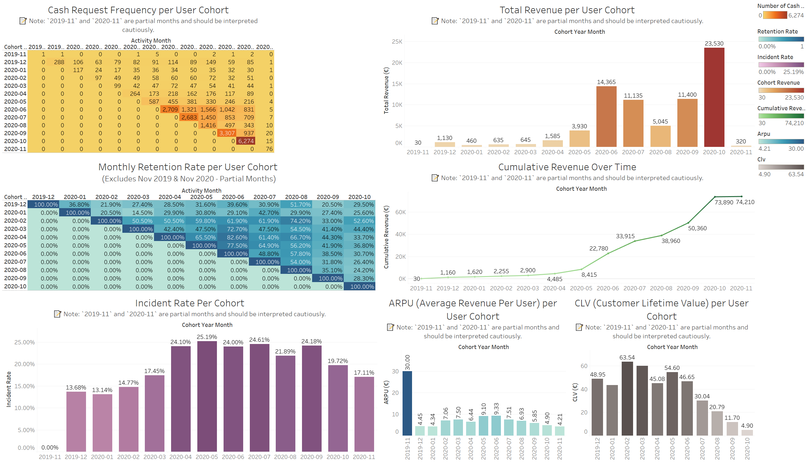

# 💳 Ironhack Payments – Cohort Analysis Project

**Data Science and Machine Learning Bootcamp – Ironhack Puerto Rico**  
📅 December 13, 2024 | 👩‍💻 Author: Ginosca Alejandro Dávila

---

## 🧠 Project Overview

This project analyzes transaction and fee data from a fintech platform using **cohort analysis techniques**. The goal is to uncover meaningful patterns in **user behavior**, **retention**, **revenue**, and **incident trends**, and translate those findings into actionable business insights.

Developed as a capstone project for the Ironhack DS/ML Bootcamp, the full workflow includes:
- Data cleaning & validation
- Exploratory Data Analysis (EDA)
- Cohort-based KPI computation:
  - **Service usage frequency**
  - **Retention rates** (monthly)
  - **Incident rates**
  - **Revenue and cumulative revenue**
  - **ARPU (Average Revenue Per User)**
  - **CLV (Customer Lifetime Value)**

> 📌 *Note: Cohorts from `2019-11` and `2020-11` represent partial months and should be interpreted with caution.*

---

## 💾 Project Structure

📂 `project-1-ironhack-payments-2-en/` → Project root folder  
├── 📂 `project_datasets/` → Provided raw `.csv` and `.xlsx` files for analysis  
├── 📂 `cleaned_project_datasets/` → Cleaned and validated datasets exported from notebook 1 (`.csv`)  
├── 📂 `eda_outputs/` → Outputs generated during exploratory data analysis  
│   ├── 📂 `data/` → Aggregated tables and cohort-ready `.csv` files for later analysis  
│   └── 📂 `plots/` → Static `.png` visualizations generated from EDA  
├── 📂 `notebooks/` → Development notebooks for each phase of the project  
│   ├── 📓 `1_data_cleaning_ironhack_payments.ipynb`  
│   ├── 📓 `2_eda_ironhack_payments.ipynb`  
│   ├── 📓 `3_cohort_analysis_metrics.ipynb`  
│   ├── 📓 `4_streamlit_app_dev.ipynb`  
│   ├── 📓 `export_ironhack_payments_notebooks_to_py.ipynb`  
│   └── 📓 `test_clean_scripts_colab.ipynb`  
├── 📂 `scripts/` → Operational Python scripts auto-exported from notebooks  
│   ├── 📂 `annotated/` → Scripts with markdown headers and comments  
│   └── 📂 `clean/` → Production-ready scripts (e.g., `4_streamlit_app_dev.py`)  
├── 📂 `reports/` → Final deliverables and written documentation  
│   ├── 📝 `1_data_quality_report_ironhack_payments.md`  
│   ├── 📝 `2_eda_report_ironhack_payments.md`  
│   ├── 📝 `3_cohort_analysis_report_ironhack_payments.md`  
│   ├── 📝 `Ironhack_Payments_Cohort_Analysis_Presentation.pptx`  
│   └── 📝 `Ironhack_Payments_Cohort_Analysis_Presentation.pdf`  
├── 📂 `dashboard/` → Tableau dashboard assets  
│   ├── 📊 `ironhack_payments_dashboard.twbx`  
│   └── 📊 `ironhack_payments_dashboard_screenshot.png`  
├── 📂 `reference/` → Provided project instructions  
│   └── 📘 `ironhack_payments_project_instructions.md`  

---

## 📊 Dashboard Preview

🖼️ 

🔗 [View Interactive Tableau Dashboard](https://public.tableau.com/views/ironhack_payments_dashboard/IronhackPaymentsCohortAnalysisDashboard)

> Built using Tableau Public Desktop. The screenshot above shows a static preview of the full dashboard layout. The `.twbx` file is also included for those who wish to open the workbook locally.

---

## 🧪 Tools & Technologies

- **Python** (Pandas, Matplotlib, Seaborn)
- **Google Colab** – Main development environment for all notebooks
- **Jupyter Notebook (local)** – Used to test `.py` scripts for reproducibility
- **Tableau Public Desktop** – Dashboard creation and visualization
- **Streamlit** – Optional app interface (runs locally via Anaconda Prompt)
- **GitHub** – Project versioning and documentation

---

## 🚀 How to Run the Streamlit App (Locally)

> Optional if you want to explore the app interface

1. Open your terminal or Anaconda Prompt  
2. Navigate to the `scripts/clean/` folder  
3. Run the app:

```bash
streamlit run 4_streamlit_app_dev.py
```

This will launch the dashboard locally in your browser. The app summarizes cohort KPIs and visual trends interactively.

---

## 📈 Summary of Key Insights

- **User Growth**: Rapid user acquisition between **April–July 2020**, peaking in June  
- **Retention**: Stronger mid-term retention in **Feb–Apr 2020** cohorts  
- **Incidents**: Surge in incident rates during **May–July 2020**, correlating with usage spikes  
- **Revenue**: Highest revenue contributions in **June–July 2020**  
- **CLV/ARPU**: Cohorts vary significantly in customer value, highlighting key opportunities for targeted retention strategies

---

## 🎯 Business Recommendations

- Prioritize re-engagement for cohorts with strong month-2 retention but quick drop-offs afterward  
- Investigate operational issues during May–July 2020 to reduce incident rates  
- Focus on onboarding practices used in Q1–Q2 2020 for future growth campaigns  
- Consider targeted promotions for high-CLV user segments

---

## 🙋‍♀️ Author

**Ginosca Alejandro Dávila**  
Data Scientist & Math Educator | Ironhack DS/ML Bootcamp Graduate  
🔗 [LinkedIn](https://www.linkedin.com/in/g-alejandro/) • [GitHub](https://github.com/ginosca)
